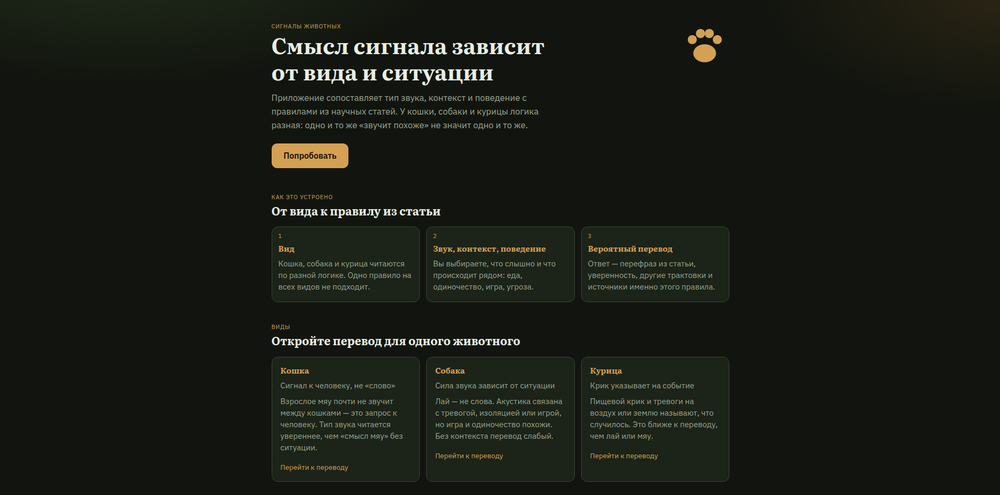
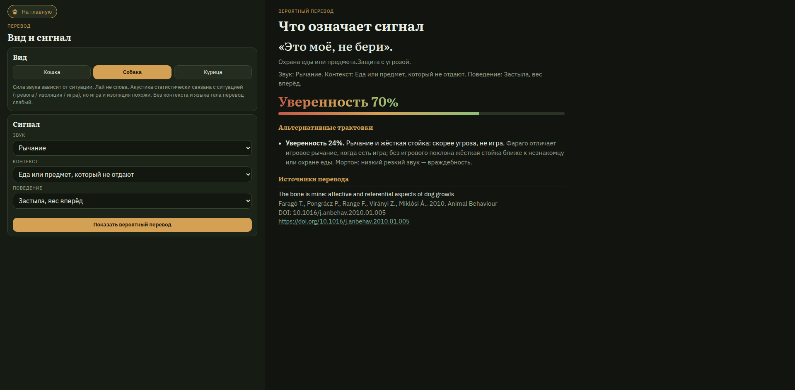

# Перевод сигналов животных

Приложение сопоставляет **тип звука, контекст и поведение** с правилами, выписанными из научных статей. Это не словарь «гав = охраняю» и не распознавание записи: поле «звук» — выбранный тип сигнала, файл не пишется и не разбирается.

Три вида, у каждого своя логика: кошка (`motivational_human`), собака (`graded_context`), курица (`referential`). Если данных мало, ответ помечается как неуверенный.

Бэкенд: Node.js + Express (TypeScript). Фронтенд: Vue 3 + Pinia. База: PostgreSQL.

## Как выглядит





## Как запустить

Одна команда поднимает Postgres, миграции (схема переводчика + БД `strapi`), Strapi, API и фронт:

```bash
docker compose up --build
```

Разработка с подхватом правок:

```bash
docker compose -f docker-compose.dev.yml up --build
```

Сервисы: `postgres` → `migrate` → `backend` + `strapi` → `frontend`.

- Интерфейс: http://localhost:5173/
- Перевод: `/perevod`, виды: `/perevod/cat`, `/perevod/dog`, `/perevod/chicken`
- Статьи: `/articles` (из Strapi)
- Админка блога: http://127.0.0.1:1337/admin (при первом заходе создайте admin)
- Браузер ходит в API переводчика через прокси `/api`
- Postgres с хоста: `127.0.0.1:5433`

Если 5173 уже занят локальным `npm run dev`, остановите его — порт нужен контейнеру.

Скопируйте `.env.example` в `.env` при необходимости. Для своего домена задайте `VITE_SITE_URL` и пересоберите фронтенд. `VITE_STRAPI_URL` по умолчанию `http://127.0.0.1:1337`.

При старте бэкенд пишет каталог в базу, **только если таблица видов пустая**. Strapi при пустой БД подхватывает seed статей.

Без Docker (локально): `npm run db && npm run migrate`, затем `npm run cms` и `npm run dev`.

Полный пересид (TRUNCATE всех таблиц каталога):

```bash
docker compose exec backend node dist-server/cli/seed.js
```

Или `SEED_ON_START=1` у сервиса `backend`.

Проверки:

```bash
npm test
npm run lint
npm run typecheck
npm run build
```

Интеграция с живой базой: `npm run db && npm run migrate && npm run seed && npm run test:integration`.

## Какие источники использованы

В каталог попали только те соответствия, которые вручную выписаны в правила. Статья не разбирается целиком: спектрограммы, породы, сырые wav-корпуса в перевод не входят.

### Кошка

| Источник                                                                                        | Что взято                                                                                  |
| ----------------------------------------------------------------------------------------------- | ------------------------------------------------------------------------------------------ |
| [Schötz et al., 2017, VIHAR](https://vihar-2017.vihar.org/assets/papers/VIHAR-2017_paper_5.pdf) | Типы звуков; агонистические (вой, рычание, шипение, сплёвывание, крик) — в конфликте кошек |
| [Schötz, 2019, FONETIK / Zenodo](https://doi.org/10.5281/zenodo.3245999)                        | Дополнительные типы и ситуации Meowsic: вой, крик боли, ласка, руки, охота                 |
| [Schötz et al., 2023](https://doi.org/10.1016/j.applanim.2023.106146)                           | 969 мяу, домашние ситуации; еда — самая частая                                             |
| [Ntalampiras et al., 2019](https://doi.org/10.3390/ani9080543)                                  | Три ситуации мяу: еда, одиночество, расчёсывание                                           |
| [Nicastro & Owren, 2003](https://doi.org/10.1037/0735-7036.117.1.44)                            | Люди слабо угадывают смысл мяу без видео — без контекста уверенность режется               |
| [McComb et al., 2009](https://doi.org/10.1016/j.cub.2009.05.033)                                | Просительное мурлыканье с «криком» ~380 Гц                                                 |
| Bradshaw & Cameron-Beaumont, 2000, _The Domestic Cat_                                           | Взрослое мяу адресовано человеку                                                           |

### Собака

| Источник                                                                | Что взято                                                         |
| ----------------------------------------------------------------------- | ----------------------------------------------------------------- |
| [Yin & McCowan, 2004](https://doi.org/10.1016/j.anbehav.2003.07.016)    | Три контекста лая: дверь / одна / игра                            |
| [Pongrácz et al., 2005](https://doi.org/10.1037/0735-7036.119.2.136)    | Люди выше случайности относят лай к ситуации и эмоции             |
| [Pongrácz et al., 2006](https://doi.org/10.1016/j.applanim.2005.12.004) | Низкий частый лай → агрессия; высокий с паузами → страх           |
| [Faragó et al., 2010](https://doi.org/10.1016/j.anbehav.2010.01.005)    | Рычание у кости, в игре и на незнакомца                           |
| [Morton, 1977](https://doi.org/10.1086/283219)                          | Низкий резкий ≈ угроза; высокий протяжный ≈ страх / умиротворение |

### Курица

| Источник                                                                            | Что взято                                             |
| ----------------------------------------------------------------------------------- | ----------------------------------------------------- |
| [Evans, Evans & Marler, 1993](https://doi.org/10.1006/anbe.1993.1158)               | Тревоги воздух / земля: реакция на запись без хищника |
| [Evans & Evans, 1999](https://doi.org/10.1006/anbe.1999.1143)                       | Пищевой крик: куры ищут еду, даже когда корма нет     |
| [Evans & Evans, 2007](https://doi.org/10.1098/rsbl.2006.0561)                       | Крик сообщает о корме, не только о возбуждении        |
| [Marler, Dufty & Pickert, 1986 I](<https://doi.org/10.1016/S0003-3472(86)80229-2>)  | Качество корма кодируется числом пищевых криков       |
| [Marler, Dufty & Pickert, 1986 II](<https://doi.org/10.1016/S0003-3472(86)80230-9>) | Кто рядом: с курицей криков больше, чем в одиночестве |

На экране перевода показываются **источники выбранного правила**, не весь список из базы.

## Где хранятся данные

Рабочая копия каталога — **PostgreSQL**. Бэкенд при переводе читает только её, не файл и не браузер. Фронтенд каталог не хранит: форма и черновик живут в Pinia, запросы идут в `/api`.

Откуда данные берутся:

| Место                                   | Роль                                                                                     |
| --------------------------------------- | ---------------------------------------------------------------------------------------- |
| `server/infrastructure/catalog/data.ts` | Канонический каталог в git: виды, статьи, звуки, контексты, поведение, правила           |
| `server/infrastructure/db/schema.sql`   | Схема таблиц                                                                             |
| PostgreSQL (Docker-том `translator_pg`) | То, с чем работает приложение. Том переживает рестарт контейнеров                        |
| `127.0.0.1:5433` с хоста                | Тот же Postgres, если смотреть с машины                                                  |
| БД `strapi` на том же Postgres          | Контент админки блога (отдельно от каталога переводчика)                                 |
| `cms/` + сервис `strapi`                | Self-hosted Strapi v5; статьи для `/articles`. Подробнее: [cms/README.md](cms/README.md) |

Первый старт с пустой таблицей видов копирует `data.ts` в базу. Дальше правки в Postgres не затираются, пока не сделать явный `seed` или `SEED_ON_START=1`.

| Таблица                           | Содержание                                                                               |
| --------------------------------- | ---------------------------------------------------------------------------------------- |
| `species`                         | Вид, латинское имя, код логики (`motivational_human` / `graded_context` / `referential`) |
| `sounds`, `contexts`, `behaviors` | Списки для формы, у каждого вида свои                                                    |
| `sources`                         | Статья: авторы, год, DOI/URL, поле `how_used` — что именно взяли                         |
| `rules`                           | Одно соответствие: какие поля должны совпасть и какой перевод                            |
| `rule_sources`                    | Какие статьи стоят за правилом                                                           |

Правило — строка «если звук X (и опционально контекст Y, поведение Z), то глянец / функция / состояние». Пустой `sound_id`, `context_id` или `behavior_id` значит: это поле правило не требует. У правила есть базовая `confidence` (0–1), текст `why`, флаг `weak` (тонкие данные) и внешние ключи на звук, контекст и поведение того же вида.

Целостность каталога проверяется тестом и перед сидом: ссылки на несуществующие id не проходят.

## Как устроена логика перевода

Код: `server/application/interpret-signal.ts` (сценарий), `server/domain/scoring/scorer.ts` (оценка), `server/domain/scoring/policies/` (отдельный файл на вид). Новый вид — новая политика, скорер не правят.

1. Пользователь выбирает вид и хотя бы одно поле: звук, контекст или поведение. Пустая форма перевода не строит.
2. Бэкенд загружает все правила этого вида.
3. Правило отбрасывается, если указанное поле **противоречит** вводу (лай при выбранном мяу не подходит).
4. Оставшиеся правила оцениваются скорером. Политика берётся из `species.logic` — новый вид = новая политика, скорер не трогают.
5. Сортировка: сначала больше совпавших указанных полей (звук + контекст + поведение), при равенстве — выше уверенность.
6. Первое правило — вероятный перевод. Следующие до трёх — альтернативы. К ответу цепляются только источники этого правила.
7. Если ни одно правило не прошло — «Перевод неизвестен», уверенность 0.

Политики по видам:

**Кошка — сигнал к человеку, не слово.** Взрослое мяу почти не используется между кошками. Тип (шипение vs мяу) читается увереннее, чем «смысл мяу» без ситуации. Слабые общие правила отбрасываются, если уже выбран контекст или поведение. Мяу без контекста специально режется (люди его плохо угадывают).

**Собака — сила звука зависит от ситуации.** Лай не слова. Акустика связана с тревогой, изоляцией или игрой, но игра и одиночество похожи. Лай без контекста и поведения — слабый перевод.

**Курица — крик указывает на событие.** Пищевой крик и тревоги на воздух или землю называют, что случилось: так реагируют на запись, даже когда причины не видно. Тип крика важнее заполненного контекста: штраф за «не тот» контекст почти не ставится, известный тип крика держит уверенность высокой.

## Как считается уверенность

Это **эвристика прозрачности**, не вероятность из классификатора и не p-value статьи. На экране она показывается полоской и подписью «Уверенность N%».

Старт — поле `confidence` у правила в каталоге (насколько соответствие в статье прямое). Дальше скорер умножает:

| Условие                                         | Множитель                                                               |
| ----------------------------------------------- | ----------------------------------------------------------------------- |
| У правила задан звук, в форме его нет           | × 0.4                                                                   |
| Задан контекст, в форме его нет                 | × 0.58 (кошка, собака) или × 0.92 (курица)                              |
| Задано поведение, в форме его нет               | × 0.72                                                                  |
| В форме есть звук, у правила звука нет          | × 0.45, затем ещё × 0.85                                                |
| В форме есть контекст, у правила контекста нет  | × 0.35, затем ещё × 0.92 (кошка и собака; у курицы этот штраф выключен) |
| В форме есть поведение, у правила поведения нет | × 0.9                                                                   |

Потом срабатывает политика вида:

- кошка, мяу без контекста → потолок **0.32**;
- собака, лай без контекста и поведения → потолок **0.32**;
- курица, известный тип крика → не ниже 95% базовой уверенности правила.

Результат зажимается в диапазон **0.08–0.92**, чтобы ни 0%, ни «почти сто» не выглядели как измерение.

Ответ помечается неуверенным, если итог **ниже 0.45** или у правила `weak = 1`. Внутренние градации `fit`: слабая ниже 0.45, средняя от 0.45 до 0.7, высокая от 0.7.

## Что сделано с помощью ИИ

Для разработки использовался ассистент в Cursor (языковая модель).

Статьи с DOI искались и читались через модель, соответствия «звук + контекст → глянец» выписаны в `data.ts` по этим работам, не сгенерированы как свободный текст.
